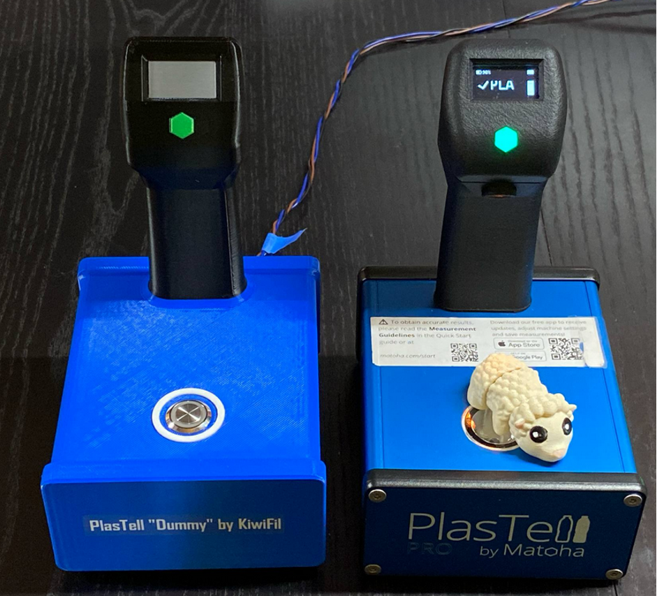
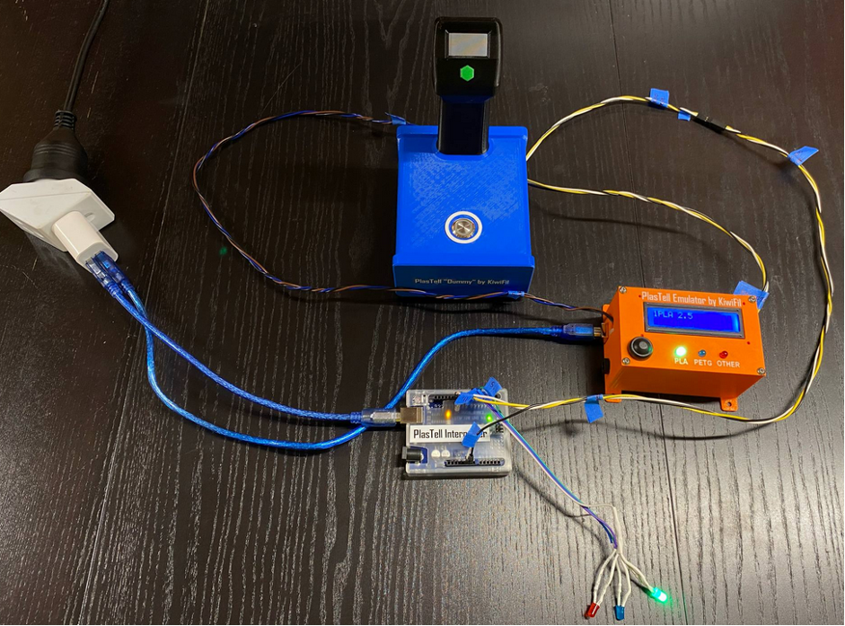
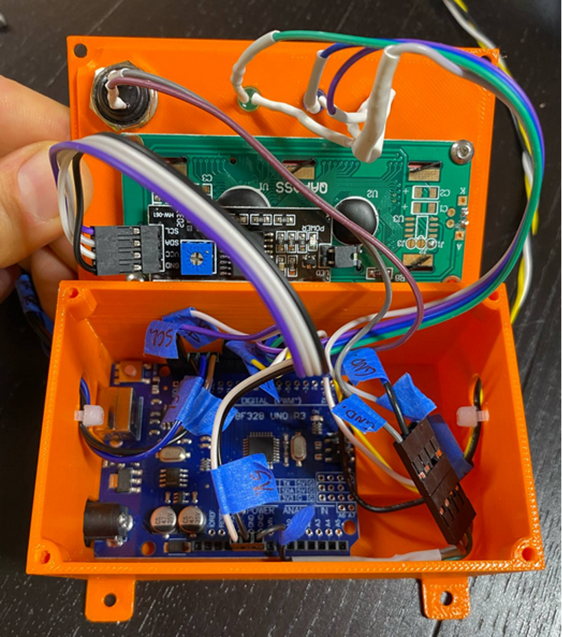
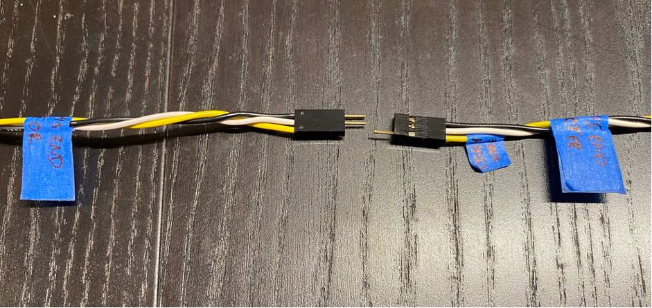
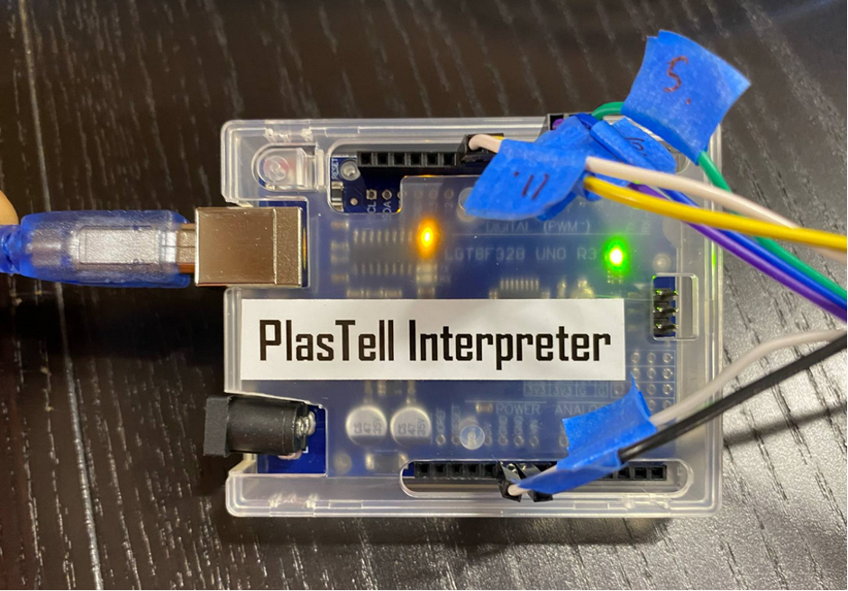
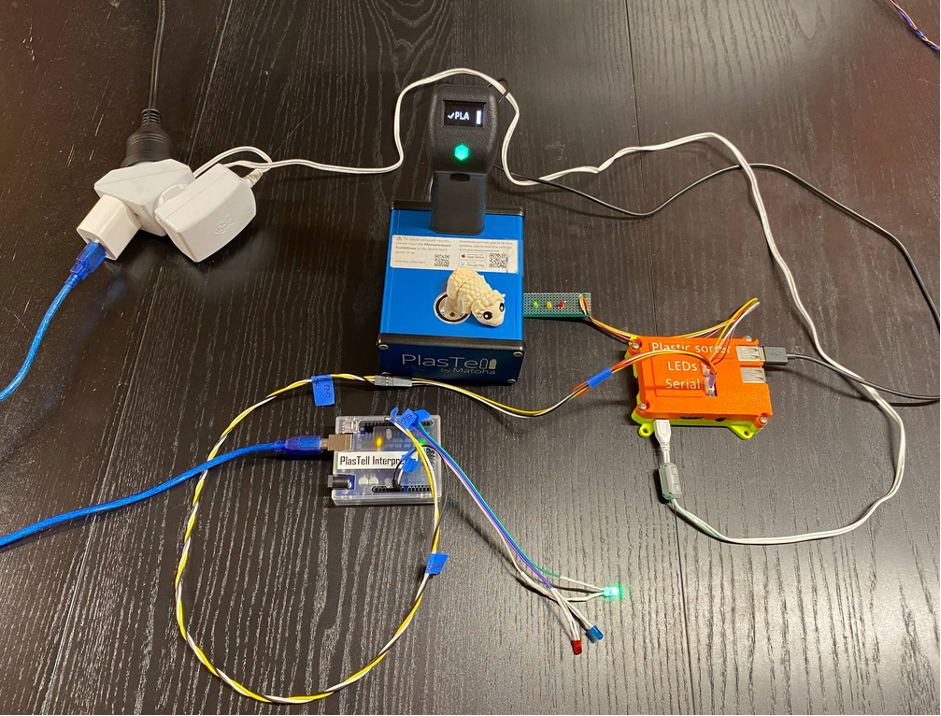

**PlasTell Dummy and Emulator by KiwiFil**

To aid the development of a 3D print sorting machine at the University of Canterbury by a Final Year Engineering Project in 2025, KiwiFil has designed an Emulator for the PlasTell scanner and the Parser described above.

A 3D printed “dummy” PlasTell Pro scanner serves as a placeholder in the sorting machine development, and the “Emulator” emulates the scanner and the Parser above.

The Emulator is based on an Arduino LGT8F328. I**mportant: This board was chosen over a regular Uno primarily because it has 3.3 V logic**, which necessary when emulating a Raspberry Pi.

When the button is pressed either on the Dummy or the Emulator, the Emulator will output a pseudo-random serial message that is identical in form and content to the messages sent by the Parser.

The code for the Emulator is provided on this page. Please note, this code was written in a hurry to give the students a head start, and it is very ugly. It contains a lot of copy and paste from tutorials (thank you all tutorial authors, you are awesome!).

Below: The Dummy next to the real PlasTell Pro by Matoha.

Below: The right-hand wires are used for the serial connection for the Emulator (and the Parser). The left-hand wires are for the Interpreter (described in the next section).

**PlasTell Interpreter by KiwiFil**

As a starting point for the Final Year Engineering Project, KiwiFil has also designed a simple Interpreter that reads the serial messages from the Emulator or Parser. The messages from the Parser are designed so the leading character carries the most important information: 0 for Start, 1 for PLA, 2 for PETG and 3 for anything else. The first version of the Interpreter simply reads the leading character and lights the corresponding LED (green for PLA, blue for PETG, and red for Other).

Important: The Interpreter is based on an Arduino LGT8F328. **This board was chosen over a regular Uno primarily because it has 3.3 V logic**, which necessary when communicating with a Raspberry Pi.

The code for the Interpreter is provided on this page. Please note, this code was written in a hurry to give the students a head start, and it is very ugly. It contains a lot of copy and paste from tutorials (thank you all tutorial authors, you are awesome!).

Below: Interpreter connected to the Parser and the actual PlasTell pro scanner.

