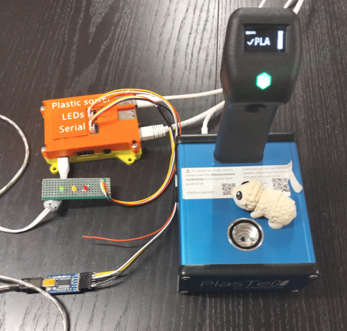
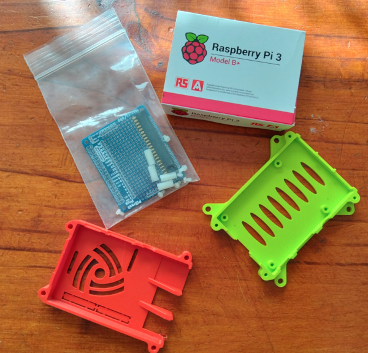
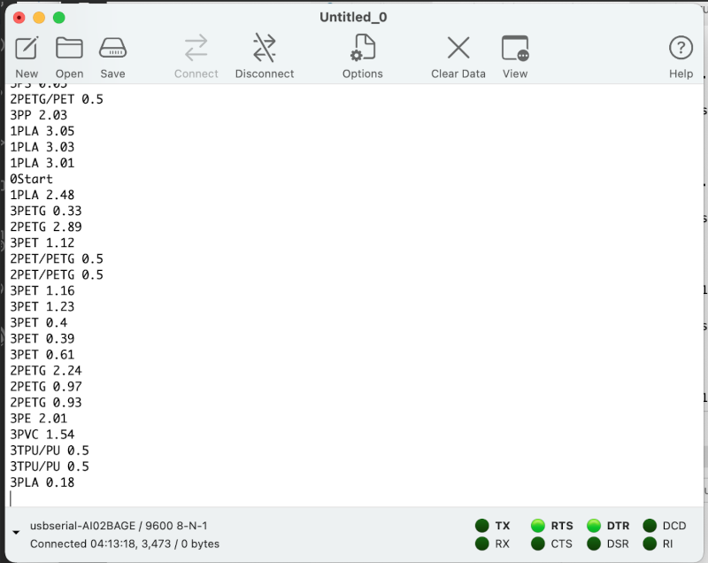
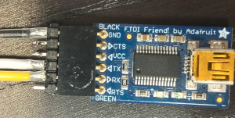

# Matoha Plastell Parser

### This project is proof of concept for automation of the Matoha Plastell Desktop plastics scanner.
Links to Matoha webesite

  [Product Link](https://matoha.com/shop/plastell-desktop-18#attr=)

  [Documentation Link](https://matoha.com/documentation)

## Raspberry Pi test rig

Plastell is implemented with an ESP32 and the USB cable presents as USB/CDC/Serial
Toggling DTR pin, will start the Plastell unit into logging mode.

We then parse the logging with a Python script, which is started with a udev rule on USB insertion.
Sample logs [here](plastel_log_sample.txt)

The python script 'plastell.py' is started automatically each time the Plastell unit is plugged into the Raspberry Pis USB port with a udev rule; [udev rule](udev-rules.txt)

3D Printed case STL files here [STL Files](RaspberryPiCase)

Modifed based on Thingiverse model: [Attribution for case](https://www.thingiverse.com/thing:922740)

## Serial output to Arduino

Simplifed scanning results are sent over a the serial port for parsing via an Arduino.

Note the first digital signifes status;
- 0 = Start
- 1 = PLA
- 2 = PETG
- 3 = Not found / fault / other

Pinout for serial output.
Serial output via 4 pin JST-PH connector TTL 3.3v , 9600 baud
 - Black = Ground
 - White = TX
 - Yellow = RX

## LEDs
The RPi has 3x 3mm LED indicators as follows
 - RED / GPIO22 = Unkown plastic / reject
 - YELLOW / GPIO23 = PETG
 - GREEN / GPIO24 = PLA
The LEDs are connected via 4 pin JST-PH connector, with 680Ohm resistors

Written as proof of concept for Kiwifil New Zealand

By Matt Way of Econode NZ April 2025
